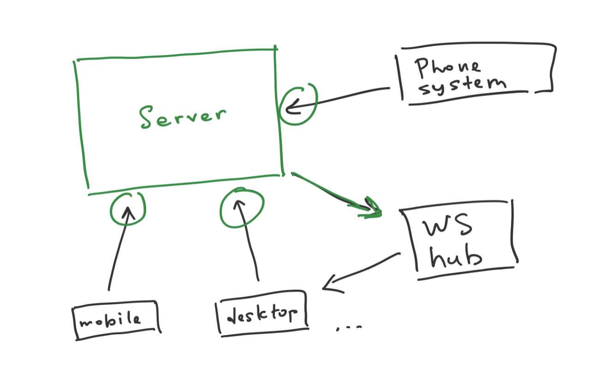

# User presence tracking 

**Goal:** design a component responsible for tracking user presence in communication app (like Microsoft Teams).

**Format:** work in group of 2-3 people. (Note: "2-3" means exactly 2 or 3. Not 1, not 4.)

**Deliverables:** assignment acceptance criteria consist of 
1) correct (compilable!) code; 
2) passing unit tests with reasonable coverage (>80%); 
3) diagram of _explicit and implicit_ dependencies (simplified UML-style: only boxes and arrows).

[Join assignment in GitHub Classroom](https://classroom.github.com/g/qudvBcjP)

---------

## I. Component behavior

From _end-user point of view_, app should have capabilities listed below. **Note**: these are top-level requirements, internal design will be more sophisticated. **You have to decide on your own about all the details: proper entry points and their format, necessary storage etc.**

| #    | Feature | Description | 
|------|-----|-----|
| 1 | Automatic "Away" | When users are inactive for certain amount of time on all connected clients (mobile, desktop, browser) their status sets to "Away" |
| 2 | Automatic "In a call" | When users are on call their status automatically sets to "In a call" |
| 3 | Automatic "In a meeting" | If users have an appointment in their calendar for current time their status automatically sets to "In a meeting" |
| 4 | Manual status | Users can manually set their status |
| 5 | External phone system integration | Users may have physical phone connected to the app. If they are on a real phone call external phone system notifies app by webhook that call started/ended. App must react and change user status appropriately: "In a call" when call starts or "Available" when call ends. |

### Some rules
1. Possible statuses are "Available", "Offline", "Away", "In a call", "In a meeting", "Do not disturb".
2. If user set status manually, automatic "Away" does not apply. Other automatic statuses still apply.
3. Manual status is automatically reset to "Available" after 2 days. 

## II. Implementation

### Scope

No need to implement a fully-functional application. You have to design only a library capable of managing login sessions (see green on the picture). Those parts in grey like DB and WS hub are out of scope here. Assume you just interact with them in some way, no need to make real calls to any real DB etc. Just design what input your component expects, what output returns, and what side-effects produces (calls outside).

### Tests

You have to cover your code with unit tests as much as possible (>80% coverage). Code included in this repository gives a sample of writing unit test for `download()` function from "Refunds" project from lectures. You can use given project structure for your implementation.

To run tests, in tests folder `KmaOoad.Coding.202.Tests` run command `dotnet test`.
 

### Development setup

* latest .NET 5 SDK ([link](https://dotnet.microsoft.com/download/dotnet/5.0))
* editor of your taste, e.g. Visual Studio OR Visual Studio Code with Ionide and Omnisharp extensions OR JetBrains Rider (see more here for [Linux](https://fsharp.org/use/linux/), [Windows](https://fsharp.org/use/windows/), and [Mac](https://fsharp.org/use/mac/))

